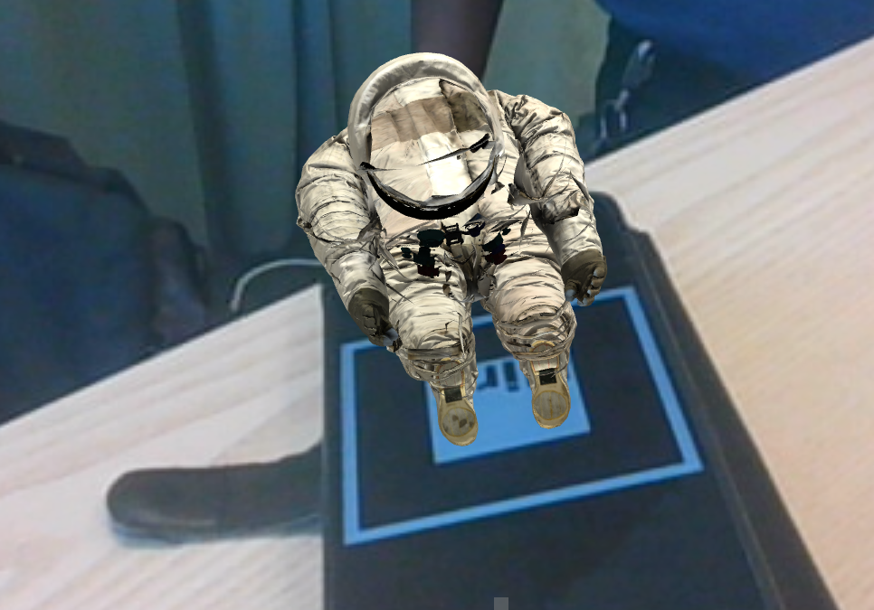

# aframe-yoman

Demo
 <br>

***


Built with [A-Frame](https://aframe.io), a web framework for building virtual reality experiences. Make WebVR with HTML and Entity-Component. Works on Vive, Rift, desktop, mobile platforms.

Click and drag on desktop. Open it on a smartphone and use the device motion sensors. Or [plug in a VR headset](https://webvr.rocks)!

## Getting Started

Run the docker start command to start a server at localhost:80
```
make start
```

If you don't have Make available then run the docker command directly
```
docker-compose up -d
```

Visit the website at [http://localhost:3000](http://localhost:3000)

Alternatively, run
´´´
python -m http.server
´´´
OR better (if you've install ´live-server´ with npm install)
´´´
live-server
´´´
